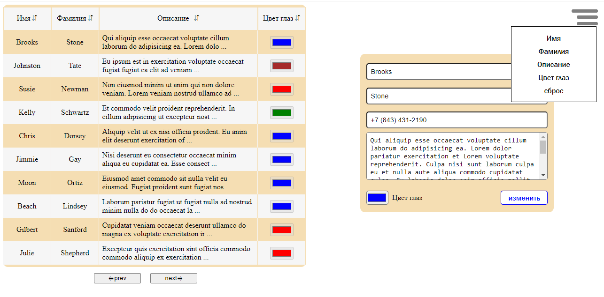

# Работа с таблицей и с БД JSON

Данное решение реализовано на чистом HTML+CSS(SASS/SCSS)+JavaScript+JSON-server для отслеживания изменений в базе данных(50 записей). При помощи fetch API я 
отправлял GET и PUT запросы. Решение реализовано модульным подходом. 

Реализованы задачи:

* Постраничного вывода на 10 строк из БД без перезагрузки страницы 

* Сортировка по имени, фамилии, описании, цвету 

* Реализовано редактирование строки при нажатии на нее(Появляется форма с полученными данными)

* Реализована настройка по сокрытии любой колонки в таблице

* реализовано изменение ряда в БД через форму изменения строки таблицы.

